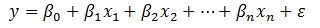

# Regression

Siddhi enables users to perform linear regression on real time data
streams. The **regress function** takes in a dependent event stream (Y),
any number of independent event streams (X1, X2,...Xn) and returns all
coefficients of the regression
equation 

The two implementations of regression could be distinguished as follows

-   **regress**: This allows you to specify the batch size (optional)
    that defines the number of events to be considered for the
    calculation of regression.
-   **lengthTimeRegress**: This allows you to specify the time window
    and batch size (required). The number of events considered for the
    regression calculation can be restricted based on the time window
    and/or the batch size.

### Input parameters for regress function

The following table describes the input parameters available for the
`regress` function.

| Parameter            | Description                                                                | Required/Optional | Default Value               |
|----------------------|----------------------------------------------------------------------------|-------------------|-----------------------------|
| Calculation Interval | The frequency with which the regression calculation should be carried out. | Optional          | `1` (i.e., for every event) |
| Batch Size           | The maximum number of events to be used for a regression calculation.      | Optional          | `1,000,000,000`             |
| Confidence Interval  | The confidence interval to be used for a regression calculation.           | Optional          | 0.95                        |
| Y Stream             | The data stream of the dependent variable.                                 | Required          |                             |
| X Stream(s)          | The data stream(s) of the independent variable.                            | Required          |                             |

**Format**: `regress(Y, X1, X2,....,Xn)`
or `regress(calculation interval, batch size, confidence interval, Y, X1, X2,....,Xn)` 

### Input parameters for lengthTimeRegress function

The following table describes the input parameters available for the
`lengthTimeRegress` function.

| Parameter            | Description                                                                | Required/Optional | Default Value       |
|----------------------|----------------------------------------------------------------------------|-------------------|---------------------|
| Time Window          | The maximum time duration to be considered for the regression calculation. | Required          |                     |
| Batch Size           | The maximum number of events to be used for a regression calculation.      | Required          |                     |
| Calculation Interval | The frequency with which the regression calculation should be carried out. | Optional          | 1 (for every event) |
| Confidence Interval  | The confidence interval to be used for a regression calculation.           | Optional          | 0.95                |
| Y Stream             | The data stream of the dependent variable.                                 | Required          |                     |
| X Stream(s)          | The data stream(s) of the independent variable.                            | Required          |                     |

**Format**:
`lengthTimeRegress(time window, batch size, Y, X1, X2,....,Xn)` or
`lengthTimeRegress(time window, batch size, calculation interval, confidence interval, Y, X1, X2,....,Xn)`. 

### Output parameters

The following table describes the output parameters.

The same output parameters are available for each implementation.

| Parameter         | Name                               | Description                                                   |
|-------------------|------------------------------------|---------------------------------------------------------------|
| Standard Error    | `stdError`                         | The standard error of the regression equation.                |
| β coefficients    | `beta0`, `beta1`, `beta2` etc.     | n+1 β coefficients where `n` is the number of `x` parameters. |
| Input Stream Data | The name given in the input stream | All the attributes sent in the input stream.                  |

The `regress` and `lengthTimeRegress` functions nullify any β
coefficients that fail the T-test based on the confidence interval. You
can access any of the output parameters using its name (as given in the
table above).

### Examples

#### Example 1

The following query submits a calculation interval (every 10 events), a
batch size (100,000 events), a confidence interval (0.95), a dependent
input stream (Y) and 3 independent input streams (X1, X2, X3) that are
used to perform linear regression between Y and all the X streams.

``` sql
from StockExchangeStream#timeseries:regress(10, 100000, 0.95, Y, X1, X2, X3)
select *
insert into StockForecaster 
```

When this query is executed, it returns the standard error of the
regression equation (ε), 4 β coefficients (β<sub>0</sub>, β<sub>1</sub>,
β<sub>2</sub>, β<sub>3</sub>) and all the items available in the input
stream. These results can be used to build a relationship between Y and
all the Xs (regression equation) as follows.

#### Example 2

The following query submits a time window (200 milliseconds), a batch
size (10,000 events), a calculation interval (every 2 events), a
confidence interval (0.95),  a dependent input stream (Y) and
an independent input stream (X) that are used to perform linear
regression between Y and all the X streams.

``` sql
from StockExchangeStream#timeseries:lengthTimeRegress(200, 10000, 2, 0.95, Y, X)
select *
insert into StockForecaster 
```

When this query is executed, it returns the standard error of the
regression equation (ε), 2 β coefficients (β<sub>0</sub>, β<sub>1</sub>)
and all the items available in the input stream.

## Attachments:

{width="8" height="8"}
[regressionEquation.jpg](attachments/57765440/57765442.jpg)
(image/jpeg)  
